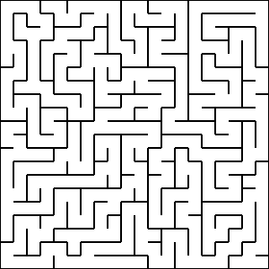
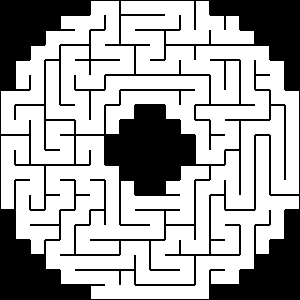
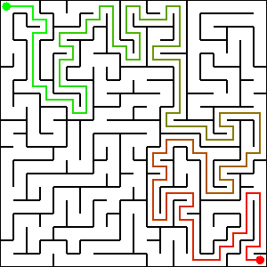

# Mazes
Simple Java library for maze generation

## How to generate a simple maze
```java
// Create maze generator instance
MazeGenerator generator = MazeGeneratorType.BACKTRACKING.getFactory().get();
// Generate 20x20 2D maze
Grid grid = generator.generate(20, 20);
```

Output:



---

## How to generate n-dimensional maze
```java
// Create maze generator instance
MazeGenerator generator = MazeGeneratorType.ALDOUS_BRODER.getFactory().get();
// Put so many dimensions as you want
Grid grid = generator.generate(20, 20, 20, ...);
```

---

## How to generate a maze with a mask
```java
// Create maze generator instance
MazeGenerator generator = MazeGeneratorType.BACKTRACKING.getFactory().get();
// Create a 20x20 grid and set the mask
Grid grid = new Grid(20, 20);
// Read mask image
BufferedImage maskImage = ImageIO.read(new File("images/mask.png"));
grid.setMask(MaskUtils.createMask2D(maskImage, 20));
// Generate the maze using the mask
generator.generate(grid, new Random());
```

Output:



---

## How to solve a maze
```java
// Create maze generator instance
MazeGenerator generator = MazeGeneratorType.BACKTRACKING.getFactory().get();
// Generate 20x20 2D maze
Grid grid = generator.generate(20, 20);

// Select an start and an end point
Cell start = grid.getCell(0, 0);
Cell end = grid.getCell(19, 19);

// Create a maze solver instance
MazeSolver solver = new BacktrackingMazeSolver();
// Find the path from start to the end point
List<Cell> path = solver.findPath(start, end);
if (path != null) {
    // Do something with the path
} else {
    // No path found
}
```

Output:



---

## How to visualize a maze
```java
// Create maze generator instance
MazeGenerator generator = MazeGeneratorType.BACKTRACKING.getFactory().get();
// Generate 20x20 2D maze
Grid grid = generator.generate(20, 20);
// Render the maze into an image
BufferedImage image = GridPrinter.toImage2D(grid, 20, 1);
// Now you can do something with the image
```

<br />

### You can also convert the Grid into tile based data structures:
```java
MazeGenerator generator = MazeGeneratorType.BACKTRACKING.getFactory().get();
// Generate 10x10 2D maze
Grid grid = generator.generate(10, 10);
// Convert the grid
boolean[][] tiles = TileExporter.export2D(grid, 1);
```

Output:

```
██████████████████████████████████████████
██              ██                  ██  ██
██  ██████  ██████  ██████  ██████  ██  ██
██      ██          ██  ██      ██      ██
██████  ██████████████  ██████  ██████████
██  ██  ██          ██      ██          ██
██  ██  ██████  ██  ██  ██  ██████████  ██
██      ██      ██      ██  ██  ██      ██
██  ██████  ██████████████  ██  ██  ██████
██          ██      ██      ██  ██  ██  ██
██████████████  ██████  ██████  ██████  ██
██              ██      ██              ██
██  ██████████  ██  ██████  ██████  ██  ██
██  ██      ██  ██  ██      ██      ██  ██
██  ██  ██  ██  ██  ██████  ██  ██████  ██
██  ██  ██      ██      ██  ██  ██      ██
██  ██  ██  ██████████  ██  ██  ██  ██████
██  ██  ██  ██          ██  ██  ██      ██
██  ██  ██████  ██████████████  ██████  ██
██  ██                          ██      ██
██████████████████████████████████████████
```
